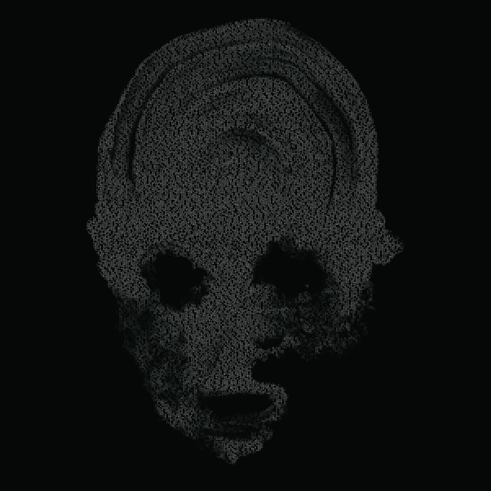

# Micrography #
A Python3 script to pull album art and lyrics into a computer generated micrograph.
Uses the  API for searching albums.


### Shoutouts! ###
* Thank you!
    * 
    * 
    * )


### Setting up lyricsgenius API ###
* Go to 
* Create an account
* Visit the  for further API documentation
* Create an API key using the  page

### Setup ###
```bash
[~]> pip3 install -r requirements.txt
```

### Usage ###
#### Help Menu ####
```bash
[~]> python3 micrography.py -h
usage: micrography.py [-h] -a  -al [-f] [-fs]

Create monographs from albums!

optional arguments:
  -h, --help        show this help message and exit
  -a, --artist      Artist
  -al, --albumi     Album Title
  -f, --font_style  Font Style
  -fs, --font_size  Font Size; Range: (5-50))
```

#### Basic Usage  ####
```bash
[~]> python3 micrography.py -a Daughters -al "You Won't Get What You Want"

Searching for "You Won't Get What You Want" by Daughters...
[+] Downloading album cover!
[+] Image saved to: ./YouWontGetWhatYouWant/album_art.jpg
[+] All lyrics written to: ./YouWontGetWhatYouWant/lyrics.jpg
[+] Saving Micrograph to: YouWontGetWhatYouWant/micrograph.png
```

#### Advanced Usage ####
##### Setting Font Style #####
```bash
[~]> python3 micrography.py -a lizzo -al "big grrrl small world" -f ./FreeMono.ttf

Searching for "big grrrl small world" by lizzo...
[+] Downloading album cover!
[+] Image saved to: ./biggrrrlsmallworld/album_art.jpg
[+] All lyrics written to: ./biggrrrlsmallworld/lyrics.jpg
[+] Saving Micrograph to: biggrrrlsmallworld/micrograph.png
```
##### Setting Font Size
```bash
[~]> python3 micrography.py -a 'ed Sheeran' -al divide -f ./FreeMono.ttf -fs 11

Searching for "divide" by ed Sheeran...
[+] Downloading album cover!
[+] Image saved to: ./divied/album_art.jpg
[+] All lyrics written to: ./divide/lyrics.jpg
[+] Saving Micrograph to: divide/micrograph.png
```

### Example Output ###
#### You Won't Get What You Want by Daughters ###

#### Big Grrrl Small World by Lizzo ####

#### Divide by Ed Sheeran ####


### Follow on steps ###
* Fix the words at the start of the image (the image starts in the middle of a sentence...)
* Create subparsers to allow for books and other mediums as well
